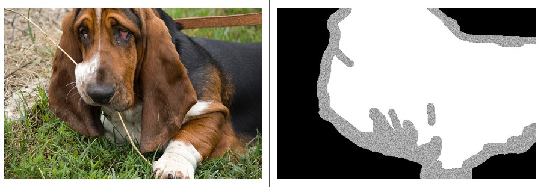

# Cats and dogs

Thank you for agreeing to do this coding challenge. We respect your time and equally commit to carefully reviewing your solution and bringing it up for debate in your follow-up interview. We have designed this test to give you a flavour of some of the challenges we have faced in our day-to-day. To reduce the complexity and expectation of being versed in medical imaging, we have curated a dataset that simulates some interesting but related challenges in everyday images. 

Are you a dog or cat person? Please accept our apologies in advance if your answer is a stern neither.


## Dataset

You are provided with a dataset of pets, more specifically cats and dogs. The dataset contains 9087 images featuring cats and dogs in various poses, backgrounds and situations. In total this dataset features 7349 unique pets. 

The dataset is made available as a release artifact on this Github repo, see: [cats_and_dogs.zip](https://github.com/harrison-ai/hai-tech-tasks/releases/download/v0.1/cats_and_dogs.zip) (~1GB).

Each sample would feature at least 1 pet and at most 2 pets. Wherever 2 pets are present, they will feature 1 cat and 1 dog. There should be no sample that features 2 cats or 2 dogs. 

You are provided with a) a CSV file featuring metadata about the dataset, b) images of the pets and c) a corresponding semantic mask for pets

### Metadata
This CSV features details about the samples. 
1. **Sample_ID**: Contains the unique ID for each sample. Using this ID you can locate the image and mask corresponding to the sample. For example, if Sample_ID is `95837f29-53d8-5761-8744-95e93e611efe` then the image and mask for this is located `<base_dataset_directory>/95837f29-53d8-5761-8744-95e93e611efe/image.jpg` and `<base_dataset_directory>/95837f29-53d8-5761-8744-95e93e611efe/mask.jpg` respectively. 
2. **Breed**: There are 37 breeds of cats and dogs in this dataset.
12 of these breeds are cats:
```
Abyssinian
Bengal
Birman
Bombay
British_Shorthair
Egyptian_Mau
Maine_Coon
Persian
Ragdoll
Russian_Blue
Siamese
Sphynx
```
The remaining 25 are dog breeds:
```
american_bulldog
american_pit_bull_terrier
basset_hound
beagle
boxer
chihuahua
english_cocker_spaniel
english_setter
german_shorthaired
great_pyrenees
havanese
japanese_chin
keeshond
leonberger
miniature_pinscher
newfoundland
pomeranian
pug
saint_bernard
samoyed
scottish_terrier
shiba_inu
staffordshire_bull_terrier
wheaten_terrier
yorkshire_terrier
```
3. **Pet_ID**: Pet ID pertains to the identity of each unique pet. In total we have 7349 unique pets being featured in this dataset. 


### Image 

Each image is 3 channel RGB JPG file. 

## Mask

The masks are packaged as single-channel grayscale images. Each pixel contains the scaled and discretized confidence of a pixel belonging to a pet (cat or dog).
1. A pixel with value 0 indicates no pet is present (100% negative)
2. A pixel with value of 255 indicates a pet is present (100% positive)
3. A pixel with a value in-between 1-254 indicates uncertainty in whether a pet is present on not. For example, a mask value of 127 would present 50% confidence in the pixel being pet. Likewise, the mask value of 204 would represent 80% confidence in the pixel being a pet. 

The following sample shows an image of a `basset_hound` dog and the corresponding mask for the dog.


Another example featuring `Ragdoll` and `basset_hound` is shown below:


## Task

Your task is to build a service that exposes an API to return three properties of the images:

1. What animals are present in the image? A cat or a dog or both.
2. Identify the breeds of the animals present in the image.
3. Provide a binary mask presenting which pixel features a pet (cat or dog) and which does not.

We won't prescribe the API specification or expected response structure. We would like to see your approach to designing this API. 

### Bonus 

There will be some brownie points if you can write a short blurb in your README.md on how you would scale your solution to:

a) Cater for images with more than 2 cats and dogs of all combinations of all breeds of pets we have seen in this dataset.
b) Scale your service to meet ~8,000 requests per second.

Both the above questions are optional and you can choose to answer neither, one, or both questions. 

## Expectations 

We would like to see your solution and notes associated with your decision-making process. As an ML Engineering team, we believe in delivering reliable, robust and quality solutions. Our focus covers delivering the best models packaged in a way that is easily deployable and usable. 

While we are not expecting you to deliver a production-ready model or solution, we would like to see the approach and thought process akin to a production solution building. To be more explicit:
1. We don't want you to build the best-performing model to break some hypothetical leaderboard. We just want to see your approach to breaking down this problem, and how you choose the configuration (data, parameters, hypermeters, layout and algorithms) of the model. If your code runs and can do 1 epoch at least then it's acceptable. If you love cats/dogs and want to spend more time then you are welcome to, however we respect your time and a workable solution is acceptable. 
2. We would like to see your software engineering best practices but we certainly don't expect you to deliver zero bug solutions. How you prioritise issues and opportunities in your solution will be of keen interest to us. 
Please do not hesitate to call out, if you are aware of things you would like to do if there were infinite hours in a day.
3. Please provide your solution such that we can run it in our environments/machines independently. 


## Disclaimer & Credits
We thank the University of Oxford for their contributions in making [Oxford Pets dataset](https://www.robots.ox.ac.uk/~vgg/data/pets/) open source and sharing with the community. This toy problem is derived from the original Oxford Pets dataset but is heavily curated and synthesized to focus on a specific problem statement.
